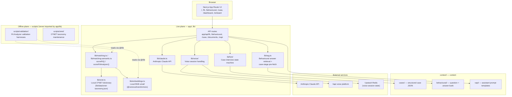

# Synthesis

A voice-enabled, retrieval-assisted interview-preparation platform, built as a
Community Analytics capstone project.

**Live demo (mock mode):** [synthesis-sand.vercel.app](https://synthesis-sand.vercel.app)

---

## Overview

Synthesis helps a candidate prepare for a real interview loop end to end:
diagnose fit against a specific job description, rehearse behavioural
answers against a prepared STAR bank, and drill live case and technical
interviews against an adaptive AI interviewer — rolled into a single
readiness picture.

## Modules

### 1. Resume-to-JD Fit Analyzer (`/fit`)
Parses a resume and a job description, grounds requirements against a
committed O\*NET taxonomy dictionary, and returns an interpretable fit
report. The production method is `hybrid_0_25`: 25% deterministic rules +
75% local semantic requirement matching when embeddings are enabled, with a
rules-only fallback when they are not.

### 2. Behavioural Interview Simulator (`/behavioural`)
Asks JD-grounded behavioural questions and scores spoken or typed answers
against the candidate's prepared STAR answer bank, with an optional live
voice interview via Vapi.

### 3. Case Interview Simulator (`/case`)
Runs an adaptive finite-state-machine interviewer that presents a case,
probes, redirects, reveals exhibits, gives hints on request, and scores the
completed session — including dedicated technical-round tracks (Data
Analyst, Data Engineer) alongside the strategy case tracks.

## Interview Flows

| Flow | Entry point | What it exercises |
|---|---|---|
| Strategy case | `/case` | FSM-driven case interviewer with clarification, structuring, analysis, and synthesis stages, timed per case (`app/api/case/*`, `app/api/vapi/case/*`) |
| Technical round | `/case` (technical tracks) | Data Analyst / Data Engineer technical question banks with dedicated Vapi assistants (`context/technical/`, `context/vapi/*-technical-round-assistant-v1.md`) |
| Behavioural | `/behavioural` | JD-grounded STAR question bank with retrieval-based answer scoring (`app/api/behavioural/*`, `app/api/vapi/behavioural/*`) |

---

## Architecture



- **Two planes:** the live plane (`/app`, `/lib`) serves the running product;
  the offline plane (`/scripts`) holds validation harnesses and O\*NET
  maintenance tooling. Offline scripts are never imported by the live plane —
  enforced by a dedicated guard test (`tests/two-plane.test.ts`).
- **No O\*NET RAG:** O\*NET grounding is a committed local JSON dictionary
  (`lib/data/onet-taxonomy.json`) loaded through `lib/onet.ts` — no vector
  database, no `onet_chunks` table, no remote retrieval service.
- **Local embeddings only:** semantic Fit Analyzer scoring runs on a local
  BGE-small model via `@xenova/transformers`, packaged at build time. Never a
  paid embeddings API.
- **No centralized database yet:** authentication and persistence are
  explicitly outside the current MVP. The future database provider is
  undecided, so there is no provider-specific client, schema, or migrations.

## Technology Stack

| Layer | Technology |
|---|---|
| Framework | Next.js 14 (App Router), React 18, TypeScript |
| Styling | Tailwind CSS |
| LLM | `@anthropic-ai/sdk` (Claude) |
| Local embeddings | `@xenova/transformers` (BGE-small, ONNX runtime) |
| Voice | `@vapi-ai/web` (Vapi voice platform) |
| Session state | `@upstash/redis` (voice session persistence across ephemeral serverless invocations) |
| Document parsing | `mammoth` (DOCX), `unpdf` (PDF) |
| Testing | Vitest |

## Local Installation & Setup

```bash
npm install
npm run dev      # http://localhost:3000
```

The app runs fully on mocks with **no real credentials required** for
`npm run dev` or `npm test`. To use live services, copy the environment
template and fill in the relevant keys:

```bash
cp .env.local.template .env.local
```

For local semantic Fit Analyzer scoring, set:

```bash
EMBEDDINGS_ENABLED=true
EMBEDDINGS_MODEL=Xenova/bge-small-en-v1.5
```

### Environment Variables

Names only — see `.env.local.template` for descriptions of each. Never commit
actual values.

| Group | Variables |
|---|---|
| Claude API | `ANTHROPIC_API_KEY`, `SYNTHESIS_MODEL_MODE`, `SYNTHESIS_LOG_USAGE` |
| Embeddings | `EMBEDDINGS_ENABLED`, `EMBEDDINGS_MODEL`, `EMBEDDINGS_MODEL_REVISION`, `BGE_INFERENCE_CONCURRENCY`, `BGE_CACHE_DIR` |
| Mode | `SYNTHESIS_USE_MOCKS`, `NODE_ENV`, `VERCEL` |
| Vapi (server) | `VAPI_WEBHOOK_SECRET`, `CASE_VOICE_ARCHITECTURE`, `VAPI_AIRPORT_ASSISTANT_ID`, `VAPI_GCC_GYM_ASSISTANT_ID`, `VAPI_DATA_ENGINEER_ASSISTANT_ID`, `VAPI_DATA_ANALYST_TECHNICAL_ROUND_ASSISTANT_ID`, `VAPI_DATA_ENGINEER_TECHNICAL_ROUND_ASSISTANT_ID` |
| Vapi (client-safe) | `NEXT_PUBLIC_VAPI_WEB_KEY`, `NEXT_PUBLIC_VAPI_BEHAVIOURAL_ASSISTANT_ID`, `NEXT_PUBLIC_VAPI_CASE_ASSISTANT_ID` |
| Case voice tuning | `CASE_VOICE_INTERVIEWER_MODE`, `CASE_VOICE_CONTROLLER_MODE`, `CASE_VOICE_REVISION_WINDOW_MS`, `CASE_VOICE_TENTATIVE_REVISION_WINDOW_MS` |
| Session storage | `UPSTASH_REDIS_REST_KV_REST_API_URL`, `UPSTASH_REDIS_REST_KV_REST_API_TOKEN` |
| Offline validation only | `OPENAI_API_KEY`, `OPENAI_MODEL` (used only by `scripts/validation/llm_family_map.py`, never on the live request path) |
| Debug flags | `VAPI_AUTH_DEBUG`, `VAPI_CASE_AUTH_DEBUG`, `VAPI_CASE_INTERVIEWER_ERROR_DEBUG`, `VAPI_CASE_LATENCY_DEBUG`, `VAPI_CASE_TURN_DEBUG` |

## Testing & Verification

```bash
npm run typecheck   # tsc --noEmit
npm test            # vitest run
npm run build       # next build + BGE bundle verification
```

## Repository Structure

```text
app/          Next.js App Router: UIs + API routes
lib/          Live utilities: parsers, scoring, O*NET dictionary, embeddings,
              retrieval helpers, case FSM, shared types
components/   Shared UI
scripts/      Offline validation + O*NET taxonomy maintenance
context/      Cases, behavioural bank, technical question banks,
              Vapi assistant prompts, JD/resume samples, scoring criteria
tests/        Vitest unit + integration tests
reports/      Generated deliverable reports
docs/         Deployment and verification notes
```

See [`CLAUDE.md`](CLAUDE.md) for build mechanics and
[`source-of-truth.md`](source-of-truth.md) for product framing and validation
methodology.

## Deployment

Deployed on Vercel. The default path is **mock mode** — a demoable public
deployment with no API keys, controlled by `SYNTHESIS_USE_MOCKS=true`. Static
content, cases, behavioural seed data, and the O\*NET taxonomy are bundled at
build time; there is no O\*NET RAG service or remote vector store to
provision. A **real mode** exists for live Claude calls and semantic scoring,
gated by `ANTHROPIC_API_KEY` and `EMBEDDINGS_ENABLED`. See
[`docs/deployment.md`](docs/deployment.md) for the full variable table and
smoke-test checklist.

## Current Project Status

Actively developed academic capstone project. Core Fit Analyzer, Behavioural
Simulator, and Case Simulator flows are implemented and covered by the
Vitest suite. There is no CI workflow configured in this repository yet, and
no committed ESLint configuration.

## Known Limitations

- No authentication or database persistence — outside the current MVP; the
  future centralized database provider is undecided.
- No O\*NET RAG layer — intentional; O\*NET grounding stays a local
  dictionary lookup rather than vector retrieval.
- The BGE embedding model is packaged at build time (`prebuild` downloads a
  pinned revision); it is not committed to the repository.
- No committed ESLint configuration, so `npm run lint` prompts for setup
  rather than running non-interactively.

## Contributors

Built by the Synthesis capstone team:

- Feroz Obaid Khan
- Rui Zhao
- Ebiokerein
- Ibukun

## License / IP Notice

© 2026 Synthesis contributors. All rights reserved. No open-source license
has been applied to this repository at this time.
