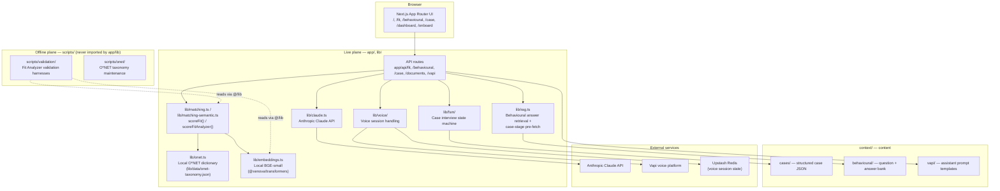

# Synthesis

**AI-powered interview readiness — resume fit, behavioural coaching, and live case/technical interview simulation in one product.**

**Live demo:** [synthesis-sand.vercel.app](https://synthesis-sand.vercel.app) (mock mode, no account required)

[Quick Start](#quick-start) · [Reproducing Synthesis](#reproducing-synthesis) · [Architecture](#architecture) · [Repository Structure](#repository-structure) · [Validation](#validation-commands)

---

## Product Overview

Interview preparation is normally scattered across a resume checklist, a stack of behavioural "tell me about a time" flashcards, and a case-interview partner who may or may not show up. Synthesis consolidates that into one place: it diagnoses how a resume matches a specific job description, runs a coached behavioural interview against the candidate's own prepared stories, and drives a live, adaptive voice interview for strategy cases and technical rounds — then rolls all of it into a single readiness picture.

**Who it's for:** candidates preparing for consulting, data, and analyst-style interview loops who want structured, repeatable practice rather than generic tips.

**Principal workflow:** a candidate lands on Synthesis, optionally sets a target role, then moves through any combination of the four practice experiences below. Each experience produces its own report; the Readiness Dashboard aggregates them into one status view so the candidate knows what to work on next.

## Product Experiences

### Resume Fit Analyzer (`/fit`)
- **Purpose:** measure how well a resume matches a specific job description before the candidate applies or interviews.
- **User input:** resume text/file (PDF, DOCX, or TXT via upload or paste) and a target job description.
- **Core processing:** the JD and resume are parsed (`lib/parsers/`), requirements are grounded against a local O\*NET taxonomy dictionary, and scored by the production `hybrid_0_25` method — 25% deterministic rule-based matching + 75% local semantic matching when embeddings are enabled, with an automatic rules-only fallback otherwise.
- **Output:** a fit score, matched/partial/missing requirement breakdown, and prioritized gaps to close.
- **External dependency:** none. This module runs entirely on local data and local computation — no Claude call, no external API.

### Behavioural Interview Coach (`/behavioural`)
- **Purpose:** rehearse structured behavioural answers (STAR format) against a role-aware question set.
- **User input:** spoken (via Vapi voice) or typed answers to a sequence of motivation/experience questions.
- **Core processing:** questions are drawn from a committed question bank; each answer is matched against the candidate's prepared answer bank (`lib/rag.ts`) and evaluated by Claude for structure and content when real-mode Claude is configured.
- **Output:** a per-question and overall readiness score plus qualitative coaching feedback.
- **External dependency:** Claude (`ANTHROPIC_API_KEY`) for real-mode evaluation; Vapi + Redis for the live voice version. Without either, the module still runs on deterministic mock scoring in text mode.

### Strategy Case Simulator ("The Grid")
- **Purpose:** practice a live, adaptive case interview (e.g. market entry, profitability) with an interviewer that probes, redirects, reveals exhibits, and gives hints.
- **User input:** spoken responses through a live voice session.
- **Core processing:** a finite-state-machine interviewer (`lib/fsm/`) advances the candidate through clarification, structuring, analysis, and recommendation stages, grounded in a committed case definition (facts, exhibits, hint ladder, rubric).
- **Output:** a stage-by-stage transcript and a scored case report.
- **External dependency:** Vapi (voice) and Redis (session state) for the live interview; Claude for the post-call scoring pass.

### Technical Interview Rounds ("The Grid")
- **Purpose:** practice role-specific technical scenario questions (currently Data Analyst and Data Engineer tracks) in a live voice format.
- **User input:** spoken responses to a fixed sequence of scenario questions per role.
- **Core processing:** questions are drawn from a committed technical question bank per role; a dedicated native Vapi assistant conducts the round.
- **Output:** a scored technical readiness report.
- **External dependency:** a dedicated native Vapi assistant ID is required per role — without it, that round returns a clear "not configured" response rather than falling back silently.

### Readiness Dashboard (`/dashboard`)
- **Purpose:** aggregate the Fit, Behavioural, and Case/Technical results for a target role into one readiness view.
- **User input:** none directly — it reads the results already produced by the other modules for the current session.
- **Core processing:** combines the three module states (`components/readiness-store.tsx`) into an overall status and a "next best action."
- **Output:** an overall readiness indicator and per-module status with links back into whichever module still needs work.
- **External dependency:** none beyond whatever the underlying modules already required to produce their results.

Proprietary scoring rubrics, case exhibit content, and Vapi/Claude system prompts are intentionally not reproduced here — see [Data and Model Provenance](#data-and-model-provenance) for what is and isn't public.

## Project Handoff

This repository **is** the technical handoff for Synthesis — there is no separate written report. Everything needed to understand, run, and verify the project is in this README and the files it links to:

- **Try it live:** [synthesis-sand.vercel.app](https://synthesis-sand.vercel.app) — no account needed, runs in mock mode.
- **Run it locally:** see [Reproducing Synthesis](#reproducing-synthesis) below for the exact clone-to-running-app sequence.
- **What works with zero configuration:** the full UI, the Resume Fit Analyzer (rules-based mode), and text-mode Behavioural/Case flows against deterministic mocks — see [Reproducibility Modes](#reproducibility-modes).
- **What requires external services:** local semantic Fit scoring (needs the local BGE model, downloaded automatically, no account), real Claude-scored feedback (needs an Anthropic API key), and any live voice interview (needs Vapi + Upstash Redis accounts) — again, see [Reproducibility Modes](#reproducibility-modes) for exactly what each level unlocks.

---

## Reproducing Synthesis

This section is the strongest guarantee in this handoff: everything here has been verified against the repository, not assumed.

### Prerequisites

| Requirement | Status |
|---|---|
| Node.js | **Not pinned to an exact version.** `package.json` only declares `"engines": { "node": ">=18.17.0" }` — no `.nvmrc`, no `.node-version`, no CI config exists to pin further. This verification snapshot (below) was produced with Node v26.0.0 / npm 11.12.1 on macOS (Darwin arm64). Treat the missing exact pin as a known reproducibility limitation, not a guess — any Node ≥18.17.0 should work, but exact behavior across major versions is unverified. |
| Package manager | npm, via the committed `package-lock.json` (`lockfileVersion: 3`). No `yarn.lock` or `pnpm-lock.yaml` exists — npm is authoritative. |
| Operating system | No OS-specific instructions exist in the repo. Native dependencies (`onnxruntime-node` for local embeddings, Next.js's `@next/swc-*`) are resolved per-platform by npm during install; nothing in the source assumes a specific OS. |
| Git LFS | **Not used.** `.gitattributes` only marks `*.pdf binary` (prevents text-diffing PDFs) — this is a plain Git attribute, not an LFS pointer. |
| Local model packaging | **Automatic.** A local BGE embedding model is downloaded during `npm run build`'s `prebuild` step — no manual download step is required (see [Data and Model Provenance](#data-and-model-provenance)). |
| External accounts | None required to install, build, typecheck, test, or browse the app in mock mode. Accounts become necessary only for specific reproducibility levels — see below. |

### Quick Start

```bash
git clone https://github.com/ferozobaid/Synthesis.git
cd Synthesis
npm ci
cp .env.local.template .env.local
npm run dev      # http://localhost:3000
```

`npm ci` is used rather than `npm install` because it installs exactly what `package-lock.json` specifies — the deterministic, reproducible install path. The app runs fully on mocks with no real credentials needed for `npm run dev` or `npm test`; `.env.local` can be left with all values blank. Never put real environment values in this README or commit them to `.env.local`.

### Environment Configuration

Every variable below is referenced somewhere in `app/` or `lib/`, and every variable in `.env.local.template` is documented below — cross-checked in both directions, nothing invented, nothing omitted. Names only; never values.

<details>
<summary><strong>Full environment variable reference (24 variables, grouped by service)</strong></summary>

**Anthropic (Claude)**

| Variable | Required? | Feature | Starts without it? |
|---|---|---|---|
| `ANTHROPIC_API_KEY` | Optional | Enables real Claude calls for Behavioural/Case evaluation | Yes — falls back to deterministic mocks |
| `SYNTHESIS_MODEL_MODE` | Optional | `"demo"` selects `claude-sonnet-4-6`; anything else uses the default `claude-haiku-4-5` | Yes — defaults to Haiku |
| `SYNTHESIS_LOG_USAGE` | Optional | Logs per-call token usage to server logs | Yes — no functional effect |

**Embeddings (local, never a paid API)**

| Variable | Required? | Feature | Starts without it? |
|---|---|---|---|
| `EMBEDDINGS_ENABLED` | Optional | Turns on real local BGE inference for the Fit Analyzer | Yes — defaults to deterministic mock embeddings / rules-only scoring |
| `EMBEDDINGS_MODEL` | Optional | Model id, default `Xenova/bge-small-en-v1.5` | Yes |
| `EMBEDDINGS_MODEL_REVISION` | Optional | Pinned Hugging Face revision hash | Yes — defaults to the pinned hash below |
| `BGE_INFERENCE_CONCURRENCY` | Optional | Bounds concurrent ONNX inference (clamped 1–4) | Yes — defaults to 2 |
| `BGE_CACHE_DIR` | Optional | Cache directory for a remotely-loaded model when packaged files are absent | Yes — defaults to `/tmp/bge-cache` on Vercel or `.cache` locally |

**Mode flags**

| Variable | Required? | Feature | Starts without it? |
|---|---|---|---|
| `SYNTHESIS_USE_MOCKS` | Optional | Forces mock (`true`) or real (`false`) mode; unset = auto-detect based on `ANTHROPIC_API_KEY` | Yes |
| `NODE_ENV` | Optional (set by tooling) | Gates debug logging in a few modules during tests | Yes |
| `VERCEL` | Optional (set by platform) | Selects cache-dir/runtime label on Vercel vs local | Yes |

**Vapi — server-only**

| Variable | Required? | Feature | Starts without it? |
|---|---|---|---|
| `VAPI_WEBHOOK_SECRET` | Optional | Bearer-token auth on the `/api/vapi/behavioural` webhook | Yes — that route's requests fail auth without it |
| `CASE_VOICE_ARCHITECTURE` | Optional, default `custom_llm` | Selects native vs custom-LLM Case voice transport | Yes |
| `VAPI_AIRPORT_ASSISTANT_ID` | Optional | Native assistant id for the Airport Profitability case | Yes — that case's native voice is unavailable |
| `VAPI_GCC_GYM_ASSISTANT_ID` | Optional | Native assistant id for the GCC Premium Gym case | Yes — same as above |
| `VAPI_DATA_ENGINEER_ASSISTANT_ID` | Optional | Native assistant id for the Data Engineer clickstream case | Yes — falls back to the custom-LLM Case transport |
| `VAPI_DATA_ANALYST_TECHNICAL_ROUND_ASSISTANT_ID` | Optional | Native assistant id for the Data Analyst technical round | Yes — round returns a 503 "not configured" response (no silent fallback) |
| `VAPI_DATA_ENGINEER_TECHNICAL_ROUND_ASSISTANT_ID` | Optional | Native assistant id for the Data Engineer technical round | Yes — same as above |

**Vapi — client-safe (`NEXT_PUBLIC_*`)**

| Variable | Required? | Feature | Starts without it? |
|---|---|---|---|
| `NEXT_PUBLIC_VAPI_WEB_KEY` | Optional | Vapi Web SDK public key | Yes — live voice unavailable, text mode unaffected |
| `NEXT_PUBLIC_VAPI_BEHAVIOURAL_ASSISTANT_ID` | Optional | Behavioural voice assistant id | Yes — same as above |
| `NEXT_PUBLIC_VAPI_CASE_ASSISTANT_ID` | Optional | Case voice assistant id | Yes — same as above |

**Case voice tuning**

| Variable | Required? | Feature | Starts without it? |
|---|---|---|---|
| `CASE_VOICE_INTERVIEWER_MODE` | Optional, default `legacy` | Internal Case voice mode selector (non-`legacy` gated to Preview/tests only) | Yes |
| `CASE_VOICE_CONTROLLER_MODE` | Optional, default `off` | Internal Case turn-taking controller mode | Yes |
| `CASE_VOICE_REVISION_WINDOW_MS` | Optional | Internal timing window for live transcript revisions | Yes — uses an internal default |
| `CASE_VOICE_TENTATIVE_REVISION_WINDOW_MS` | Optional | Internal timing window for tentative transcript revisions | Yes — uses an internal default |

**Session storage (Redis)**

| Variable | Required? | Feature | Starts without it? |
|---|---|---|---|
| `UPSTASH_REDIS_REST_KV_REST_API_URL` | Required for voice sessions only | Voice-session state store (Vercel functions are ephemeral) | Yes for the app overall — no for any voice-session flow, which throws a clear configuration error |
| `UPSTASH_REDIS_REST_KV_REST_API_TOKEN` | Required for voice sessions only | Same | Same as above |

**Offline validation only (never on the live request path)**

| Variable | Required? | Feature | Starts without it? |
|---|---|---|---|
| `OPENAI_API_KEY` | Optional | Used only by `scripts/validation/llm_family_map.py` | Yes — app runtime never reads this |
| `OPENAI_MODEL` | Optional, default `gpt-4o-mini` | Same script | Yes |

**Debug flags** (all optional, no functional effect beyond extra server logs)

`VAPI_AUTH_DEBUG`, `VAPI_CASE_AUTH_DEBUG`, `VAPI_CASE_INTERVIEWER_ERROR_DEBUG`, `VAPI_CASE_LATENCY_DEBUG`, `VAPI_CASE_TURN_DEBUG`

</details>

### Reproducibility Modes

Synthesis has distinct levels of reproducibility depending on which external accounts are configured. None of them are required to explore the product.

| Level | What works | Required services | Limitations | How to verify |
|---|---|---|---|---|
| **1. Local UI & static application** | Every page renders; Fit Analyzer runs in rules-only mode; Behavioural/Case/Technical run in text mode against deterministic mocks | None | No live voice; Claude feedback is mocked placeholder text, not real evaluation | `npm run dev`, browse `/`, `/fit`, `/behavioural`, `/case`, `/dashboard` |
| **2. Fit Analyzer with local semantic resources** | Full `hybrid_0_25` scoring (25% rules + 75% local semantic match) | None — the BGE model downloads automatically, no account | Slower first build while the model downloads | Set `EMBEDDINGS_ENABLED=true`, run `npm run build`, POST a resume/JD pair to `/api/fit/analyze`, confirm the response's `scoring.method` is `"hybrid_0_25"` and `scoring.embedding_backend` is `"bge"` |
| **3. Full behavioural voice flow** | Live spoken behavioural interview with real Claude-scored feedback | `ANTHROPIC_API_KEY`, Vapi web key + behavioural assistant id, Upstash Redis | Requires browser microphone permission; Claude output is non-deterministic | Start a behavioural voice session in the browser and confirm a live transcript and Claude-generated report appear |
| **4. Full case & technical voice flows** | Live spoken case and technical interviews with adaptive FSM behavior and real scoring | Everything in Level 3, plus per-case/per-role native Vapi assistant ids | Any case/round without its assistant id configured returns a clear "not configured" response rather than degrading silently | Start a case or technical round voice session and confirm live stage transitions and a final scored report |
| **5. Production-equivalent deployment** | The full app as deployed on Vercel | All of the above, deployed with real-mode env vars per `docs/deployment.md` | Cold-start latency for the packaged BGE bundle; see [Known Limitations](#known-limitations) | Follow the pre-deploy verification and smoke-test checklist in `docs/deployment.md` |

Nothing above is claimed to work without the services listed — each claim traces to a specific code path (`lib/config.ts`'s `useMocks()`/`hasAnthropic()`, `lib/voice/session-store.ts`'s Redis guard, and the native-assistant-id checks in `lib/voice/case-native-config.ts`).

### Deterministic versus Non-Deterministic Behaviour

| Behaviour | Deterministic? | Why |
|---|---|---|
| `npm run typecheck` | Yes | Pure static analysis against committed source |
| `npm test` | Yes | Claude and the embedding model are both mocked/stubbed at the module boundary (`lib/__mocks__/claude.ts`, `setEmbeddingLoaderForTests()`); no network calls occur in the suite |
| `npm run build` | Yes, given the same pinned model revision | The BGE model download is pinned to an exact Hugging Face revision hash, not a floating tag; `verify-bge-bundle.mjs` re-checks required paths and a size ceiling on every run |
| Local O\*NET grounding | Yes | Static committed JSON, no external call |
| Local BGE embeddings | Yes, for a given pinned revision | Same input text produces the same vector for a fixed model revision |
| LLM-generated qualitative feedback (real mode) | **No** | Claude calls use `temperature: 0` for near-deterministic decoding, but there is no caching/memoization layer, and model behavior is not guaranteed byte-for-byte reproducible across API calls or model updates |
| Voice transcription | **No** | Vapi's speech-to-text is an external, real-time third-party service; nothing in this repo mocks or caches it for real-mode use |
| Live interview conversations | **No** | Depends on the candidate's actual spoken/typed input plus live model responses |

In short: the structural verification commands (`typecheck`, `test`, `build`) are fully reproducible and are the right tools for confirming "does this still work." Anything involving live Claude or voice output will vary run to run by design — that's expected, not a defect.

### Data and Model Provenance

- **O\*NET grounding:** a single committed file, `lib/data/onet-taxonomy.json` (~66 KB), loaded via a static import in `lib/onet.ts`. No database client, no fetch call, no remote read — confirmed by direct inspection of `lib/onet.ts`. The taxonomy is generated offline from a local O\*NET 30.3 database by `scripts/onet/extract_taxonomy.py`; the raw O\*NET database itself is gitignored and never committed.
- **Local embedding model:** `@xenova/transformers` running `Xenova/bge-small-en-v1.5` (384-dimensional), pinned to Hugging Face revision `ea104dacec62c0de699686887e3f920caeb4f3e3`. Downloaded automatically into a gitignored `models/` directory by the `prebuild` npm lifecycle script (`scripts/download-bge-model.mjs`) — no manual step, no paid API. `scripts/verify-bge-bundle.mjs` then confirms the model and its ONNX runtime are correctly traced into the Fit Analyzer's serverless function bundle, under a 225 MB size ceiling.
- **No remote vector database is used anywhere.** There is no `onet_chunks` table, no pgvector, no hosted vector search — O\*NET grounding and semantic Fit scoring are both entirely local.
- **Question banks and case content:** committed JSON under `context/behavioural/`, `context/cases/`, and `context/technical/` (see [Repository Structure](#repository-structure) for what each contains). Vapi assistant system prompts live in `context/vapi/*.md` — referenced here by location only; their content is not reproduced in this README.
- **Existing checksum/manifest evidence:** `reports/fit-validation/` contains de-identified validation manifests (`code-validation-summary.json`, `human-validation-manifest.json`, `snapshot-checksums.json`) with SHA-256 hashes for the validation implementation, packaged model files, and input/output artifacts. These manifests contain no raw resume or job-description text and no scoring rubric content — they exist to let a reviewer confirm what code and data produced a given metric, without exposing the underlying material.

### Validation Commands

```bash
npm run typecheck   # tsc --noEmit
npm test             # vitest run
npm run build        # next build + BGE bundle verification
```

- **`npm run typecheck`** proves the TypeScript source compiles cleanly — no type errors anywhere in `app/`, `lib/`, `components/`, or `tests/`.
- **`npm test`** proves the Vitest suite passes deterministically, with no network calls or credentials required.
- **`npm run build`** proves the Next.js production build succeeds, the pinned BGE model downloads and is correctly packaged into the Fit Analyzer's serverless function, and the resulting bundle stays under its size ceiling.

Lint (`npm run lint` → `next lint`) is **not currently runnable non-interactively** — no ESLint configuration is committed to the repository, so the command prompts interactively to create one rather than linting. This is a pre-existing limitation, documented honestly here and in [Known Limitations](#known-limitations) rather than papered over; no ESLint config was added as part of this documentation pass.

`git diff --check` was also run against this documentation change and reported no whitespace or conflict-marker errors.

#### Expected Results

| Command | Purpose | Expected successful outcome |
|---|---|---|
| `npm run typecheck` | Static type validation | Exits 0, no errors printed |
| `npm test` | Runs the deterministic Vitest suite | All test files report passed |
| `npm run build` | Production build + BGE bundle verification | Build completes; a `[bge-bundle] Verified N files (X MB)` line is printed |

<details>
<summary><strong>Verification snapshot — commit <code>c5b8fb9</code>, verified 2026-07-29</strong></summary>

Environment: Node v26.0.0, npm 11.12.1, macOS (Darwin arm64). Counts below are a point-in-time snapshot, not a permanent guarantee — they will change as the project evolves; re-run the commands above for current numbers.

| Command | Result |
|---|---|
| `npm run typecheck` | Passed, no errors |
| `npm test` | Passed — 84/84 test files, 1261 tests passed, 1 skipped |
| `npm run build` | Passed — 21 routes built, BGE bundle verified (115 files, 125.0 MB, under the 225 MB ceiling) |

</details>

### Troubleshooting

- **Missing environment variables:** the app is designed to degrade gracefully — missing Claude/Vapi/Redis variables fall back to mocks or a clear "not configured" response rather than a crash. If a page fails to load at all, first confirm `.env.local` exists (`cp .env.local.template .env.local`) even if every value is left blank.
- **Voice features unavailable locally:** confirm `NEXT_PUBLIC_VAPI_WEB_KEY` and the relevant module's assistant id are set, and that your browser has granted microphone permission for `localhost`.
- **Browser microphone permissions:** voice interviews require an explicit microphone grant; if the browser silently blocks it, check the site permissions icon in the address bar rather than assuming the app is broken.
- **Redis connection failures:** voice-session-backed flows (Behavioural/Case voice) throw a clear `VoiceSessionStoreError` naming the two missing Upstash variables — this only affects voice sessions, not text-mode flows or the Fit Analyzer.
- **Model artifact or build issues:** if `npm run build` fails at the `prebuild` step, confirm outbound network access to Hugging Face is available; the download is pinned by revision hash, so a partial/corrupted download is the most common cause — deleting the gitignored `models/` directory and re-running `npm run build` forces a clean re-download.
- **Interactive lint command:** `npm run lint` will prompt for ESLint setup rather than running — this is expected (see [Known Limitations](#known-limitations)); do not create a config file to "fix" this unless you intend to commit one deliberately.
- **Vercel Preview Protection:** if you deploy your own preview and it prompts for authentication before showing the app, that is Vercel's Preview Protection on preview deployments, not an application bug — the production deployment linked at the top of this README does not have this enabled.

---

## Architecture



- **Two planes:** the live plane (`/app`, `/lib`) serves the running product;
  the offline plane (`/scripts`) holds validation harnesses and O\*NET
  maintenance tooling. Offline scripts are never imported by the live plane —
  enforced by a dedicated guard test (`tests/two-plane.test.ts`).
- **No O\*NET RAG:** O\*NET grounding is a committed local JSON dictionary
  (`lib/data/onet-taxonomy.json`) loaded through `lib/onet.ts` — no vector
  database, no `onet_chunks` table, no remote retrieval service.
- **Local embeddings only:** semantic Fit Analyzer scoring runs on a local
  BGE-small model via `@xenova/transformers`, packaged at build time. Never a
  paid embeddings API.
- **No centralized database yet:** authentication and persistence are
  explicitly outside the current MVP. The future database provider is
  undecided, so there is no provider-specific client, schema, or migrations.

---

## Technology Stack

| Layer | Technology |
|---|---|
| Framework | Next.js 14 (App Router), React 18, TypeScript |
| Styling | Tailwind CSS |
| LLM | `@anthropic-ai/sdk` (Claude) |
| Local embeddings | `@xenova/transformers` (BGE-small, ONNX runtime) |
| Voice | `@vapi-ai/web` (Vapi voice platform) |
| Session state | `@upstash/redis` (voice session persistence across ephemeral serverless invocations) |
| Document parsing | `mammoth` (DOCX), `unpdf` (PDF) |
| Testing | Vitest |

---

## Repository Structure

```text
Synthesis/
├── app/                  Next.js App Router: pages + API routes (live plane)
│   ├── api/              API routes: fit, behavioural, case, documents, vapi
│   ├── fit/               /fit page
│   ├── behavioural/        /behavioural page
│   ├── case/               /case page ("The Grid")
│   ├── dashboard/          /dashboard page
│   └── onboard/             /onboard page
├── components/            Shared React UI (live plane)
├── context/                Committed content consumed by the app
│   ├── behavioural/         Question bank + seed answer bank
│   ├── cases/                Structured strategy-case and technical-round definitions
│   ├── technical/             Data Analyst / Data Engineer technical question banks
│   └── vapi/                   Vapi assistant prompt templates (not reproduced here)
├── lib/                    Live-plane utilities
│   ├── data/                 lib/data/onet-taxonomy.json — committed O*NET dictionary
│   ├── parsers/                Resume/JD parsers
│   ├── fsm/                     Case interview state machine
│   └── voice/                    Voice session handling, Vapi integration, Redis store
├── scripts/               Offline plane — never imported by app/ or lib/
│   ├── validation/           Fit Analyzer validation harnesses
│   ├── onet/                   O*NET taxonomy maintenance
│   ├── download-bge-model.mjs   Downloads the pinned BGE model (runs via npm's prebuild)
│   └── verify-bge-bundle.mjs     Verifies the model is correctly bundled after build
├── tests/                  Vitest unit + integration tests (84 files)
├── types/                  Ambient TypeScript declarations (Web Speech API)
├── verify/                 Manual real-mode smoke-test driver (not part of npm test)
├── reports/                Generated deliverable reports + de-identified validation snapshots
├── docs/                   Deployment and verification notes
├── package.json
├── AGENTS.md               Canonical build/architecture instructions
├── CLAUDE.md               Pointer to AGENTS.md for Claude Code
├── source-of-truth.md      Product-level decisions and validation methodology
└── README.md
```

### Live plane versus offline plane

This separation is enforced, not just documented: `tests/two-plane.test.ts` statically scans every file in `app/` and `lib/` and fails if any of them imports from `/scripts`. The reverse is allowed and used — `scripts/validation/` imports live-plane utilities like `lib/matching.ts` and `lib/embeddings.ts` to validate them offline.

- **`app/`** — every page (`page.tsx`) and API route (`route.ts`) a user or client actually hits. `app/api/` is grouped by module: `fit/`, `behavioural/`, `case/`, `documents/`, and `vapi/` (the Vapi webhook and native voice endpoints).
- **`app/api/`** — 16 route files. Notably `app/api/fit/analyze/route.ts` (the Fit Analyzer entry point, no external call), `app/api/vapi/case/chat/completions/route.ts` (the custom-LLM transport for Case voice), and per-session routes under `[sessionId]` for reports and live clocks.
- **`components/`** — shared UI: voice interview components (`CaseVoiceInterview.tsx`, `VoiceInterview.tsx`), document input, the readiness store (`readiness-store.tsx`) that backs the Dashboard, and page-specific subfolders (`hero/`, `home/`, `interviewer/`, `ui/`).
- **`context/behavioural/`** — `question_bank.json` and `seed_answer_bank.json`, the committed source for the Behavioural Coach's questions and the STAR answer matching baseline.
- **`context/cases/`** — one structured JSON definition per case/technical round (stages, probe banks, hint ladders, exhibits, scoring rubric), plus a `-live-interviewer` variant per case for the native voice architecture.
- **`context/technical/`** — `data_analyst.json` and `data_engineer.json`, the scenario-question banks for the Technical Interview Rounds.
- **`context/vapi/`** — Markdown system-prompt templates per Vapi assistant, referenced by the app but not reproduced in this documentation.
- **`lib/`** — the core of the live plane: parsers, matching/scoring (`matching.ts`, `matching-semantic.ts`), the O\*NET module, the embeddings module, the case FSM, voice/session handling, and shared types.
- **`lib/data/`** — exactly one committed file, `onet-taxonomy.json`, the entire O\*NET grounding dictionary.
- **`scripts/`** — the offline plane. `scripts/validation/` holds the Fit Analyzer validation harnesses (described in `scripts/validation/README.md`); `scripts/onet/` holds the taxonomy-extraction tooling that produced `lib/data/onet-taxonomy.json`; `download-bge-model.mjs` and `verify-bge-bundle.mjs` are the two scripts that run automatically as part of `npm run build` (see [Data and Model Provenance](#data-and-model-provenance)).
- **`tests/`** — 84 Vitest files covering behavioural, case/FSM, voice/Vapi routes, parsers, matching/embeddings, config, dashboard/UI state, and the two-plane boundary guard itself.
- **`verify/`** — `real-mode.mjs`, a manual HTTP smoke-test driver for real-mode verification against a running dev server; intentionally not part of `npm test` since it requires live credentials.
- **`reports/`** — `Synthesis_Fit_Validation_Study.pdf`, its generator script (`build_reports.py`), and `reports/fit-validation/` (de-identified validation snapshots — see [Data and Model Provenance](#data-and-model-provenance)).
- **`docs/`** — `deployment.md` (Vercel deployment guide) and `real_mode_verification.md`.

---

## Deployment

Deployed on Vercel. The default path is **mock mode** — a demoable public deployment with no API keys, controlled by `SYNTHESIS_USE_MOCKS=true`. Static content, cases, behavioural seed data, and the O\*NET taxonomy are bundled at build time; there is no O\*NET RAG service or remote vector store to provision. A **real mode** exists for live Claude calls and semantic scoring, gated by `ANTHROPIC_API_KEY` and `EMBEDDINGS_ENABLED`. See [`docs/deployment.md`](docs/deployment.md) for the full variable table and smoke-test checklist.

## Current Project Status

Actively developed academic capstone project. Core Fit Analyzer, Behavioural Coach, Strategy Case, and Technical Round experiences are implemented and covered by the Vitest suite. There is no CI workflow configured in this repository, and no committed ESLint configuration.

## Known Limitations

- No authentication or database persistence — outside the current MVP; the future centralized database provider is undecided.
- No O\*NET RAG layer — intentional; O\*NET grounding stays a local dictionary lookup rather than vector retrieval.
- The BGE embedding model is packaged at build time (`prebuild` downloads a pinned revision); it is not committed to the repository.
- No committed ESLint configuration, so `npm run lint` prompts for setup rather than running non-interactively.
- No exact Node.js version is pinned — only the `>=18.17.0` floor in `package.json`.
- No CI workflow is configured, so the verification commands in this README have not been run by an automated pipeline — they are verified manually, as documented in the [snapshot above](#expected-results).
- Real-mode Claude output and Vapi voice transcription are inherently non-deterministic (see [Deterministic versus Non-Deterministic Behaviour](#deterministic-versus-non-deterministic-behaviour)).

## Contributors

Built by the Synthesis capstone team:

- Feroz Obaid Khan
- Rui Zhao
- Ebiokerein
- Ibukun

## License / IP Notice

© 2026 Synthesis contributors. All rights reserved. No open-source license has been applied to this repository at this time.

---

Before submitting or sharing this repository, test both the repository link and the live demo link while **signed out of GitHub or in an incognito/private browser window** — this is the only reliable way to confirm a grader, judge, or employer with no prior access will actually be able to reach both.
